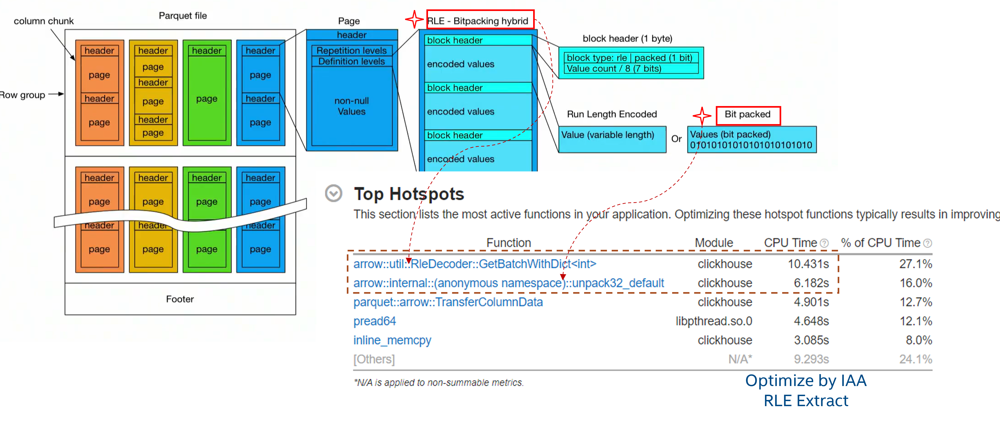
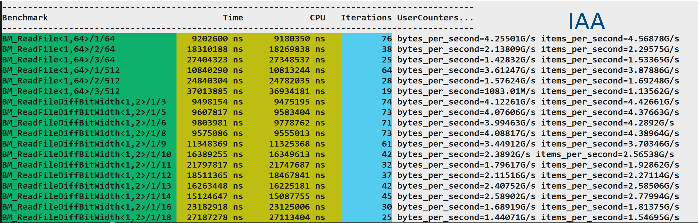
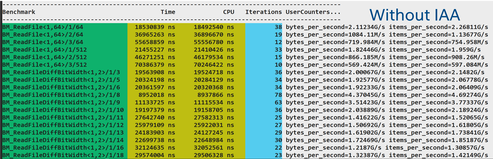

# Build Arrow with IAA Rle Decoder


## Introduction

This guide is for users who are already familiar with Arrow.  It provide IAA solution to Apache Arrow. Apache Parquet is an open source, column-oriented data file format designed for efficient data storage and retrieval. It provides efficient data compression and encoding schemes with enhanced performance to handle complex data in bulk.

Run Length Encoding and Bit-Packing Hybrid encoding uses a combination of bit-packing and run length encoding to more efficiently store repeated values. Intel® In-Memory Analytics Accelerator(IAA) has the RLE decoding ability which we provide the ability to Arrow RleDecoder.





## Build

### System Requirements

Intel® In-Memory Analytics Accelerator(IAA) is a built-in accelerator in 4th Gen Intel® Xeon® Scalable processors. Sapphire Rapids Server platform is need to enable IAA.

#### Hardware Path Requirements

Enable/Disable device with <a href="#accel-config">accel-config tool</a>

Enable device example(enable 1 IAA device, configure 1 IAA work queue and 1 engines resource).
```
accel-config config-engine iax1/engine1.0 -g 0
accel-config config-wq iax1/wq1.0 -g 0 -s 16 -p 10 -b 1 -t 15 -m shared -y user -n app1 -d user
accel-config enable-device iax1
accel-config enable-wq iax1/wq1.0
```

### Software Path Requirements

The solution is built based on Apache Arrow Relase version 10.0.0

| Software | Version |
|------------------|-------------|
| Apache Arrow | 10.0.0 |
| Operating System | Linux |


### Building Arrow

1. Clone git source with the following command.
```
git clone -b apache-arrow-10.0.0 https://github.com/apache/arrow.git
git apply arrow_rledecode_with_iaa.patch
```

2. Build the Arrow
Follow the guide (https://arrow.apache.org/docs/developers/cpp/building.html#building-arrow-c) to build Arrow. Note that you should set cmake flag $\color{orange}{-DARROW_WITH_QPL=ON}$

Example:
```
mkdir build
cd build
cmake -DCMAKE_BUILD_TYPE=Release -DCMAKE_INSTALL_PREFIX=<install_dir> -DARROW_WITH_QPL=ON ..
cmake --build . --target install
```
3. The resulting library will be available in the folder <install_dir>.

4. If you want to compare performance with IAA and without IAA, you can run the benchmark test ```parquet-qpl-reader-benchmark```. The parquet testing data can be downloaded from https://github.com/yaqi-zhao/parquet-testing/tree/master/data. Here is an example of the benchmark result.




## Conclusion

This solution is based on Apache Arrow Release version 10.0.0. If you want to built on other version or if you have any questions, please reach out and let us know.

## Related Tools and Information

1. <a id="accel-config">accel-config tool</a>

Accel-config is a utility library for controlling and configuring IAA (In-Memory Analytics Accelerator) sub-system in the Linux kernel.  Please use "accel-config -h" to check if the tool works. If not, please git clone https://github.com/intel/idxd-config.git and follow README to build and install it.

2. <a id="IAA-Spec">Intel® In-Memory Analytics Accelerator Architecture Specification</a>: https://www.intel.com/content/www/us/en/content-details/721858/intel-in-memory-analytics-accelerator-architecture-specification.html?wapkw=In-memory%20accelerator

## Feedback

We value your feedback. If you have comments (positive or negative) on this guide or are seeking something that is not part of this guide, please reach out and let us know what you think.