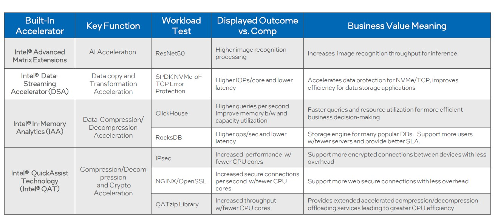

# Intel® Vector Data Streaming Library

Intel Vector Data Streaming Library is a zoo of solutions based on accelerators in the die of Intel 4th Xeon Scalable processor,code-named [“Sapphire Rapids”](https://www.intel.com/content/www/us/en/newsroom/opinion/updates-next-gen-data-center-platform-sapphire-rapids.html?wapkw=Intel%20Sapphire%20Rapids%20Demos%20At%20Innovation%202022#gs.g4fsrh). Intel provide a boundle of powerful accelerators for different scenarios as below table.

|Built-in Accelerator                 | Key Function                                | Accelerator Zoo | Solutions                   | Business Value                        |
|:------------------------------------|:------------------------------------------- |:----------------|:----------------------------|:--------------------------------------|
|Intel Data streaming accelerator(DSA)| Data copy and transformation accaleration   |DSAZoo           |User space network stack acceleration with DSA| improve efficiency for data transition|
|Intel In-memory Analytics(IAA)       | Data compression/decompression acceleration |IAAZoo           |                             |                                       |
|Intel QuickAssist Technology(QAT)    | Compression/decompression/Crypto acceleraion|QATZoo           |                             |                                       |
|Intel Dynamic Load Balance(DLB)      | Improves performance related to handling network data|DLBZoo           |                    |                                       |    

Picture for referencing(To be updated, need source material input):  

To expound how to utilize each powerful accelerator, we provide reference solutions.
#  Solution List
- DSA  
  User space network acceleration with DSA.
- IAA
- DLB
- QAT 
